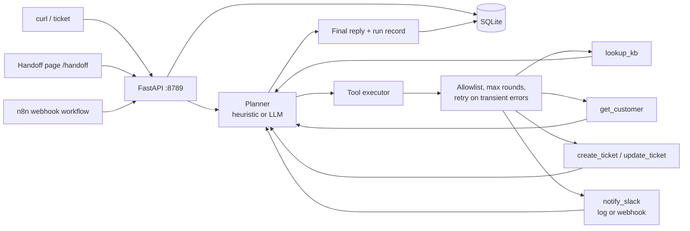
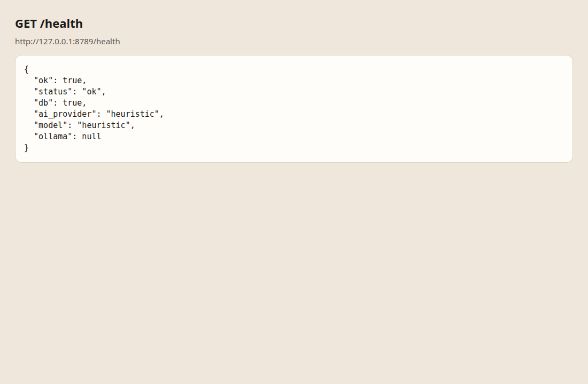
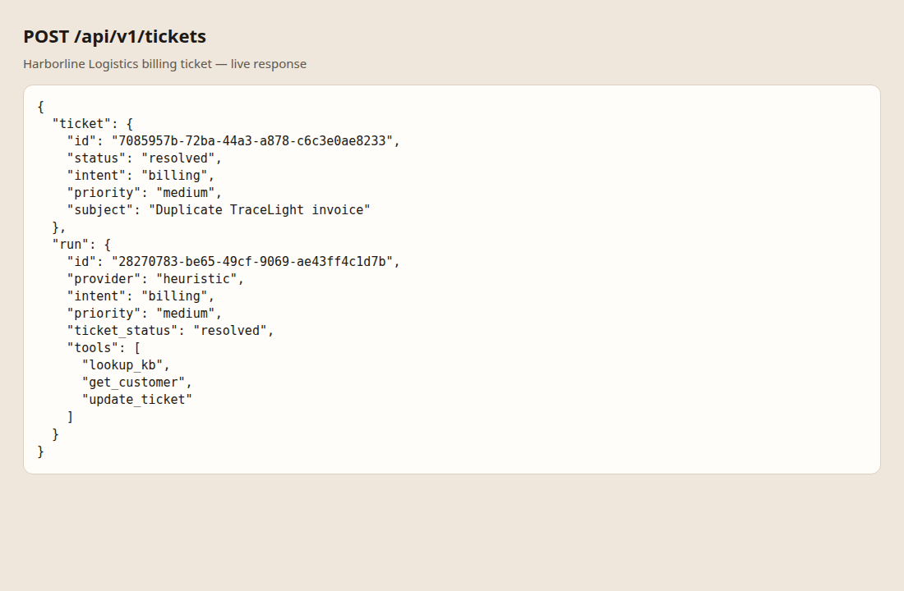
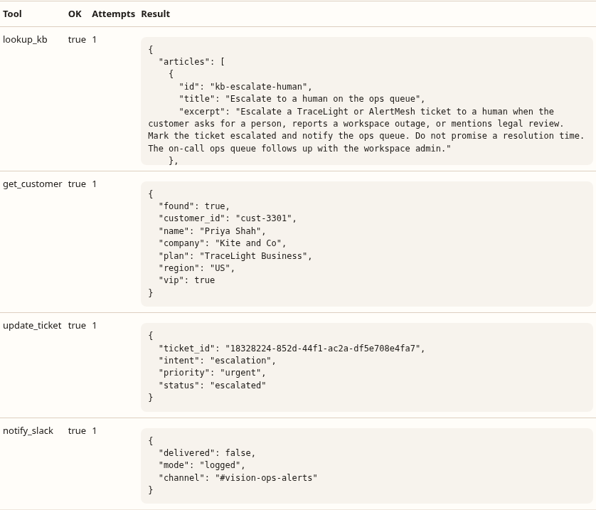
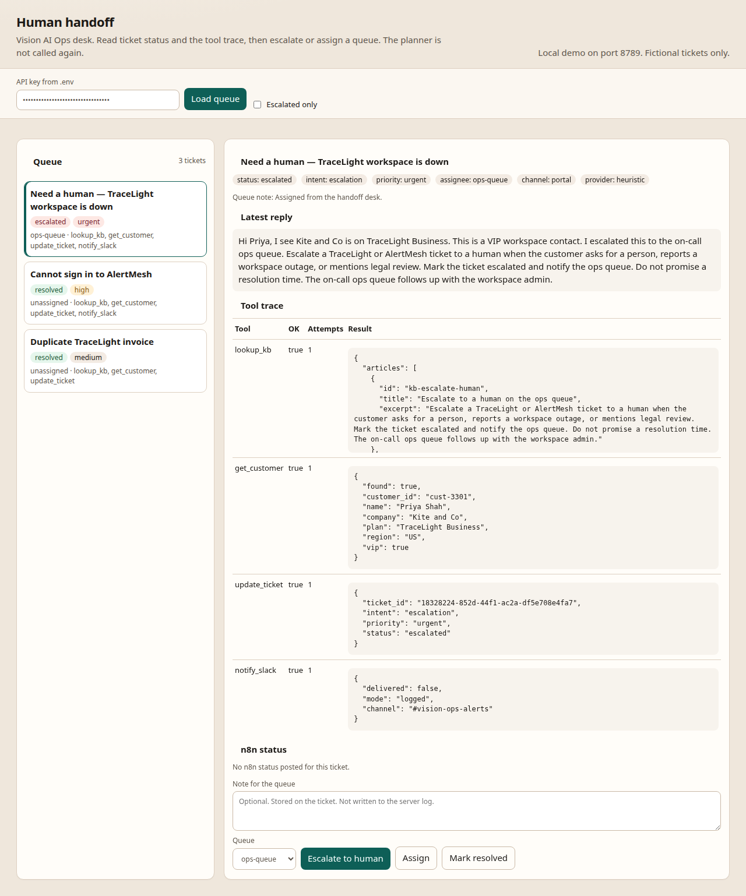
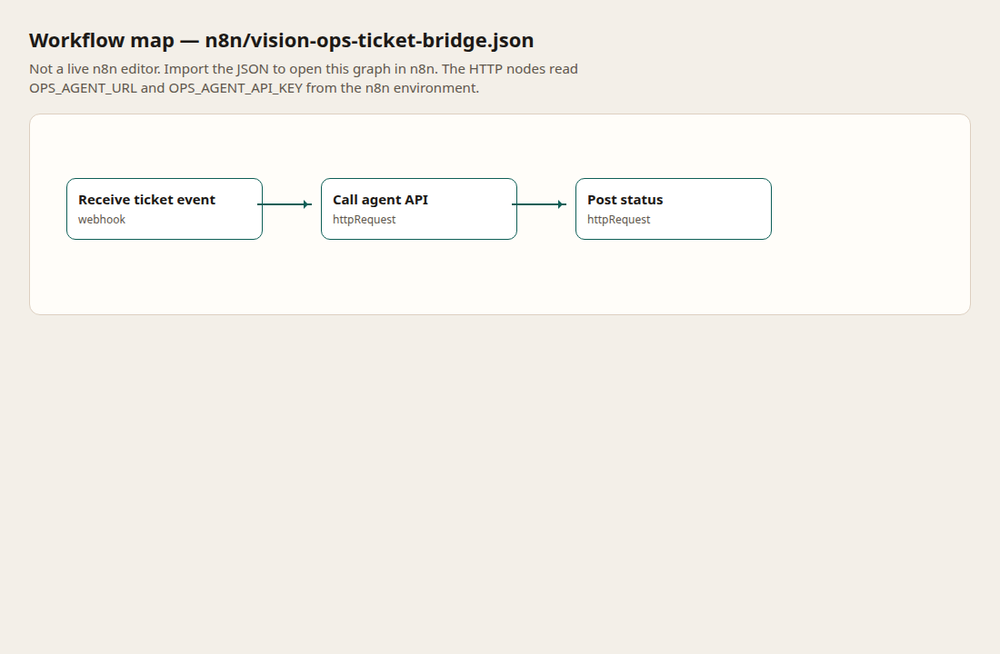

# Customer Operations Agent

[](https://github.com/Birra3324/customer-operations-agent/actions/workflows/ci.yml)

> Open to remote AI automation roles. Email: birragimedi@gmail.com | GitHub: @Birra3324 | LinkedIn: linkedin.com/in/birra-gemedi

FastAPI service that turns a support ticket into a structured agent run: a planner chooses the next step, an executor calls allowlisted mock tools, and SQLite stores the plan, tool trace, reply, and ticket status.

Built as a local portfolio demo. The default planner is a deterministic heuristic, so clone, pytest, and the walkthrough need no GPU, no Ollama, and no paid API key. Ollama or OpenAI are optional via environment variables. Source: [github.com/Birra3324/customer-operations-agent](https://github.com/Birra3324/customer-operations-agent) (no hosted demo URL).

Sample tickets are fictional **Vision AI Ops** requests (TraceLight / AlertMesh), the same made-up company as the company RAG demo. There is no real customer data in git.

**How to demo:** [10–15 minute walkthrough](docs/demo.md) — venv, uvicorn on `:8789`, post the three [example tickets](examples/demo_requests.json), open the [handoff page](http://127.0.0.1:8789/handoff), then the [n8n bridge](docs/n8n.md). Screenshots: [docs/screenshots](docs/screenshots/).

**Status (Days 19–25):** [checklist](docs/status.md). Days 26–30 are listed there as next.

This is not a UiPath, Workato, MuleSoft, or ServiceNow project.

## Architecture



The planner and the executor are separate roles. Each round the planner emits a thought plus either a tool call or a final reply. The executor runs only registry tools, appends the result, and hands control back. That trace is what `GET /api/v1/runs/{id}` returns.

Direct `POST /api/v1/tickets` creates the row and runs the agent. `POST /api/v1/agent/run` does the same for a new ticket, or runs again on an existing `ticket_id`. The handoff page reads that stored trace and can escalate or assign a queue without starting another run. The n8n workflow posts to the same API.

Details, including the flaky-tool retry: [docs/architecture.md](docs/architecture.md).

## Stack

| Piece | Default (offline) | Optional via env |
| --- | --- | --- |
| API | FastAPI on Python 3.12, port **8789** | — |
| Planner | Deterministic heuristic (`AI_PROVIDER=heuristic`) | Ollama `llama3.2`, or OpenAI |
| Tools | Local KB + CRM JSON, SQLite ticket updates, Slack log | Slack incoming webhook |
| Data | SQLite `data/ops.db` | — |
| Tests | pytest + TestClient, LLM HTTP mocked | CI never calls Ollama or OpenAI |
| CI | GitHub Actions, Python 3.12, `pytest` | No secrets |

Ports `8787` and `8788` are reserved for the intake and RAG demos. This service uses `8789`.

## Setup (under 10 minutes)

```bash
git clone https://github.com/Birra3324/customer-operations-agent.git
cd customer-operations-agent
python3 -m venv .venv
source .venv/bin/activate
pip install -r requirements.txt
cp .env.example .env
```

`.env.example` already sets `API_KEY=change-me-to-a-long-random-string` and `AI_PROVIDER=heuristic`. Use that same key in the shell. Do not commit a real `.env`.

```bash
export API_KEY=change-me-to-a-long-random-string
uvicorn app.main:app --reload --host 127.0.0.1 --port 8789
```

Or: `./scripts/run_dev.sh`

In a second terminal:

```bash
export API_KEY=change-me-to-a-long-random-string
curl -sS http://127.0.0.1:8789/health

curl -sS -X POST http://127.0.0.1:8789/api/v1/tickets \
  -H "content-type: application/json" \
  -H "X-API-Key: $API_KEY" \
  -d @<(jq '.[0]' examples/demo_requests.json)
```

Without `jq`: `API_KEY="$API_KEY" python scripts/post_demo.py`

Health (no key): `GET http://127.0.0.1:8789/health`

## Environment variables

See `.env.example`.

| Variable | Purpose |
| --- | --- |
| `API_KEY` | Required for `/api/v1/*`. Empty key: process will not start, and routes return 503. `GET /health` is public. |
| `DATABASE_URL` | `sqlite:///./data/ops.db` (default). |
| `AI_PROVIDER` | `heuristic` (default), `ollama`, or `openai`. |
| `OLLAMA_URL` / `OLLAMA_MODEL` | Used only when `AI_PROVIDER=ollama`. |
| `OPENAI_API_KEY` | Used only when `AI_PROVIDER=openai`. Never hard-coded. If it is missing, the run falls back to the heuristic planner. |
| `SLACK_WEBHOOK_URL` | Incoming webhook. If empty, `notify_slack` logs and does not post. |
| `MAX_TOOL_ROUNDS` | Planner/executor cap (default 6). |
| `SIMULATE_FLAKY_TOOL` | When `true`, `lookup_kb` fails once per run and the executor retries with backoff. |
| `ALLOWED_TOOLS` | Comma-separated allowlist. Names outside the registry never run. |
| `OPS_AGENT_URL` | Used by n8n, not by this process. Default `http://127.0.0.1:8789`. |
| `OPS_AGENT_API_KEY` | Used by n8n, not by this process. Set it to the same value as `API_KEY` in the n8n environment. Leave it blank in git. |

## API

| Method | Path | Auth |
| --- | --- | --- |
| GET | `/health` | public |
| POST | `/api/v1/tickets` | `X-API-Key` — create ticket and run the agent |
| GET | `/api/v1/tickets` | `X-API-Key` |
| GET | `/api/v1/tickets/{id}` | `X-API-Key` |
| GET | `/api/v1/runs/{id}` | `X-API-Key` |
| POST | `/api/v1/agent/run` | `X-API-Key` — new ticket, or rerun by `ticket_id` |
| GET | `/handoff` | public HTML. The page sends `X-API-Key` from a password field |
| GET | `/api/v1/handoff/queue` | `X-API-Key` — status, assignee, tool names |
| GET | `/api/v1/handoff/tickets/{id}` | `X-API-Key` — ticket, tool trace, n8n events |
| POST | `/api/v1/handoff/tickets/{id}` | `X-API-Key` — `escalate`, `assign`, or `resolve` |
| POST | `/api/v1/integrations/n8n/inbound` | `X-API-Key` — ticket event from the n8n workflow |
| POST | `/api/v1/integrations/n8n/status` | `X-API-Key` — workflow status callback |
| GET | `/api/v1/integrations/n8n/events` | `X-API-Key` |

Shapes: [docs/api.md](docs/api.md). A full offline example body is in [examples/sample_responses.json](examples/sample_responses.json).

The run record includes `plan` (planner and executor steps), `tool_calls`, `final_reply`, `intent`, `priority`, and `ticket_status`.

## Tools

| Tool | What it does |
| --- | --- |
| `lookup_kb` | Searches `data/kb.json` (fictional Vision AI Ops articles). |
| `get_customer` | Reads `data/crm.json`. Email stays in the file and is not returned. |
| `create_ticket` | Inserts a ticket row. The HTTP create path opens the row first; the tool is for agent-driven creates. |
| `update_ticket` | Sets intent, priority, and status on the current ticket only. |
| `notify_slack` | Sends ticket id, intent, and priority. Logs when the webhook is unset. |

There is no shell tool and no general HTTP tool. Slack is the only outbound call, and only to `SLACK_WEBHOOK_URL` when it is set.

## Docker

```bash
cp .env.example .env
docker compose up --build
```

Compose runs the API on port 8789 with a SQLite volume. `API_KEY` is required. The default provider inside the container is `heuristic`, so the container does not need Ollama.

## Testing

```bash
python3 -m venv .venv
.venv/bin/pip install -r requirements.txt
.venv/bin/pytest -q
```

Tests use a temp SQLite file and mock LLM HTTP. They do not call Ollama or OpenAI. The same command runs on GitHub Actions (push and pull request to `main`).

Golden scenarios (billing, password reset, escalate to a human):

```bash
./scripts/eval.sh
```

## Demo data

Three fictional tickets live in [examples/demo_requests.json](examples/demo_requests.json):

- Billing question — Harborline Logistics, duplicate TraceLight invoice
- Password reset — Northglass Bakery, AlertMesh sign-in
- Escalate to a human — Kite and Co, workspace outage

Expectations for those three are in [evals/scenarios.json](evals/scenarios.json).

## Handoff and n8n

With the API running, open [http://127.0.0.1:8789/handoff](http://127.0.0.1:8789/handoff), paste `API_KEY`, and load the queue. You can escalate, assign `ops-queue`, `billing-desk`, or `access-desk`, or mark a ticket resolved. That does not call the planner again.

The n8n workflow is [n8n/vision-ops-ticket-bridge.json](n8n/vision-ops-ticket-bridge.json). Import notes and the no-n8n curl path are in [docs/n8n.md](docs/n8n.md).

```bash
API_KEY="$API_KEY" python scripts/post_n8n_demo.py
```

## Screenshots

Captured from a local heuristic run. How to regenerate: [docs/screenshots/README.md](docs/screenshots/README.md).











The n8n image is a map of the committed workflow, not a live n8n editor.

## Later

Days 26–30 are not built: batch intake, a downloadable run export, a handoff audit list, an optional Ollama pass, and a one-page case study. See [docs/status.md](docs/status.md).

## License

MIT © 2026 Birra Gemedi

## Reliability boundaries

The API requires a nonempty `API_KEY` at startup and fails closed if that configuration is missing. Health remains public. Use a private value before any hosted deployment; the example string is for local clone-and-run only.

Operational logs omit ticket bodies, subjects, CRM emails, and Slack text at the default log level. Tool results stored on the run record are part of the product response; the CRM tool drops email before that result is saved.

Tool calls stay inside the registry and the allowlist. A model that asks for `shell` is recorded as `tool_not_allowed` and is not executed. `lookup_kb` can throw one simulated transient error (`SIMULATE_FLAKY_TOOL=true`); the executor retries with exponential backoff and skips the sleep when `APP_ENV=test`.

Slack delivery is best effort. An unset webhook is a log line, not a durable outbox. This repository does not claim production readiness.
