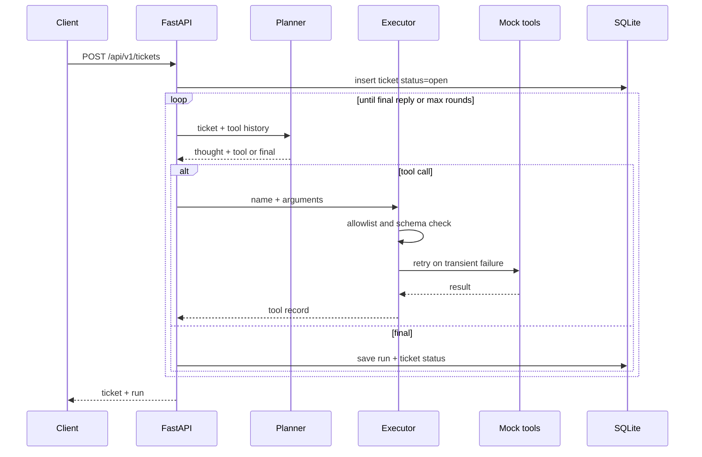

# Architecture

Local customer operations agent. No hosted URL. Default path does not call a model.

## Flow

`POST /api/v1/agent/run` uses the same loop. Pass `ticket_id` to run it again on a stored ticket.

## Planner and executor

Two roles, one process:

| Role | Default | Optional |
| --- | --- | --- |
| Planner | `HeuristicPlanner` walks a fixed order: knowledge base, CRM when `customer_id` is set, ticket update, Slack when priority is high or urgent, then a reply built from tool results | `LlmPlanner` asks Ollama or OpenAI for one JSON action per round |
| Executor | `execute_tool` in `app/tools/executor.py` | — |

If the remote model errors, returns invalid JSON, or omits a final reply, the planner switches to the heuristic for the rest of that run and sets `fallback` to `heuristic`. The ticket is still stored.

The heuristic labels intent with keyword rules in `app/agent/classify.py`:

| Intent | Priority | Ticket status | Slack |
| --- | --- | --- | --- |
| `billing` | medium (high if the text says urgent, overcharged, or asap) | `resolved` | only when priority is high |
| `password_reset` | high | `resolved` | yes |
| `escalation` | urgent | `escalated` | yes |
| `general` | low | `waiting_customer` | no |

## Tools

The registry in `app/tools/__init__.py` is the only callable surface:

- `lookup_kb` — token overlap against `data/kb.json`
- `get_customer` — exact `customer_id` in `data/crm.json` (email is not copied into the result)
- `create_ticket` — insert a row
- `update_ticket` — update the ticket this run is handling; a different id returns `ticket_mismatch`
- `notify_slack` — metadata line (`ticket_id`, intent, priority) to the configured channel

Guardrails:

- **Allowlist.** `ALLOWED_TOOLS` intersected with the registry. `shell`, `os.system`, and any other name return `tool_not_allowed` with zero attempts. Putting `shell` on the allowlist still does nothing, because it is not in the registry.
- **Arguments.** Each tool has a Pydantic model with `extra=forbid`. Unknown fields such as a URL on `lookup_kb` return `invalid_arguments` and the tool body does not run.
- **Max rounds.** `MAX_TOOL_ROUNDS` (default 6). Hitting the cap stores `status=needs_review` and does not keep calling tools.
- **No open network.** Knowledge and CRM reads are local files. Ticket writes are SQLite. The only HTTP client in the tool layer is the Slack webhook, and only when `SLACK_WEBHOOK_URL` is set. The message body is built inside the tool; planner-supplied prose is not posted.
- **Channel.** `notify_slack` accepts only `SLACK_CHANNEL` (default `#vision-ops-alerts`).

## Retry and backoff

`lookup_kb` is the simulated flaky tool. Set `SIMULATE_FLAKY_TOOL=true` and the first call in a run raises `TransientToolError`. The executor retries up to `TOOL_MAX_ATTEMPTS` (default 3).

Delay after attempt `n` is `min(2s, TOOL_RETRY_BASE_SECONDS * 2^(n-1))` (default base 0.2s: 0.2s, 0.4s, 0.8s). `APP_ENV=test` records the delay and does not sleep, so pytest stays fast.

The tool record shows `attempts` greater than 1 when a retry happened. Other tools do not use this retry loop unless they raise `TransientToolError`. Slack failures are a single attempt and do not fail the run.

The demo default is `SIMULATE_FLAKY_TOOL=false`, so a recruiter walkthrough is a clean success path. Turn the flag on when you want to show the retry.

## Logging

Default level is INFO. Lines include tool name, ok/attempts, intent, priority, channel, and request id. They do not include the ticket subject, body, CRM email, model prompt, or Slack text.

`get_customer` results omit email even though `data/crm.json` contains fictional `@example` addresses for realism.

## Persistence

SQLAlchemy `create_all()` on startup. Tables: `tickets`, `agent_runs`. SQLite is the demo and CI database. Alembic is not included; this is a local portfolio schema.

JSON columns on `agent_runs` store `plan` and `tool_calls`.

## Auth

`X-API-Key` on every `/api/v1/*` route, compared with `secrets.compare_digest`. Missing configuration is HTTP 503. A wrong key is HTTP 401. `GET /health` does not check the key. Startup raises if `API_KEY` is blank, so a half-configured process does not serve mutating routes.

Health reports the provider. It pings Ollama only when `AI_PROVIDER=ollama`, so the heuristic default does not touch the network.

## Human handoff

`GET /handoff` is a static page. The browser sends `X-API-Key` from a password field to:

- `GET /api/v1/handoff/queue`
- `GET /api/v1/handoff/tickets/{id}`
- `POST /api/v1/handoff/tickets/{id}`

Escalate, assign, and resolve update the ticket row only. They do not call the planner, so the stored tool trace stays the one from the last agent run. Assignee values are the three queue names in `app/models/schemas.py`. Notes are on the ticket response and are left out of the log line (`handoff_updated` records action, assignee, and status).

SQLite files created before these columns exist get `assignee`, `handoff_note`, and `handoff_at` from `ensure_ticket_handoff_columns` during `init_db`. New databases get the columns from `create_all`. There is still no Alembic migration.

## n8n bridge

The workflow in `n8n/vision-ops-ticket-bridge.json` is inactive until someone turns it on. Webhook, then `POST /api/v1/integrations/n8n/inbound`, then `POST /api/v1/integrations/n8n/status`.

Inbound uses the same `add_ticket` and `run_agent` path as `POST /api/v1/tickets`. When `external_id` is set, a `dedupe_key` of `n8n:ticket.created:{external_id}` makes a second delivery return the original run. Status events are extra rows on `integration_events` and do not change the ticket. The API key stays in the n8n environment (`OPS_AGENT_API_KEY`), which this process does not read.

The only outbound HTTP from tools is still the Slack webhook, and only when `SLACK_WEBHOOK_URL` is set. The n8n nodes call this API; this API does not call n8n.
